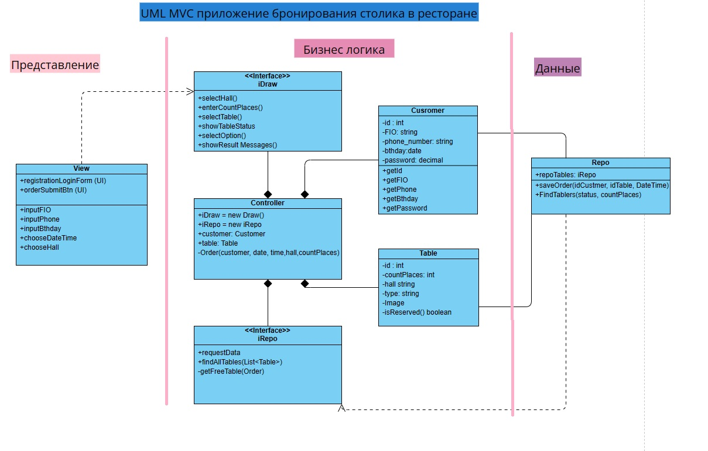
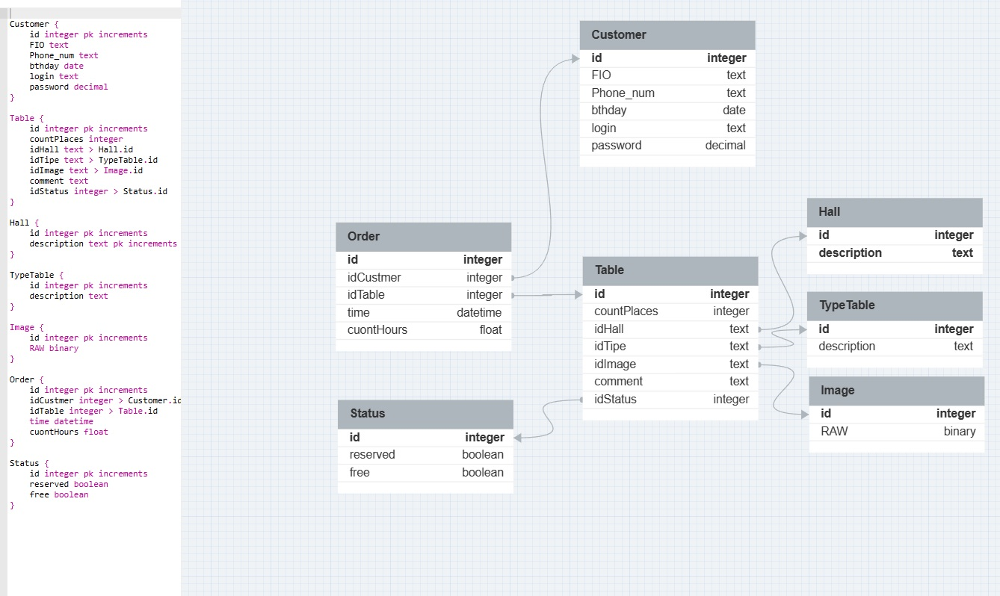
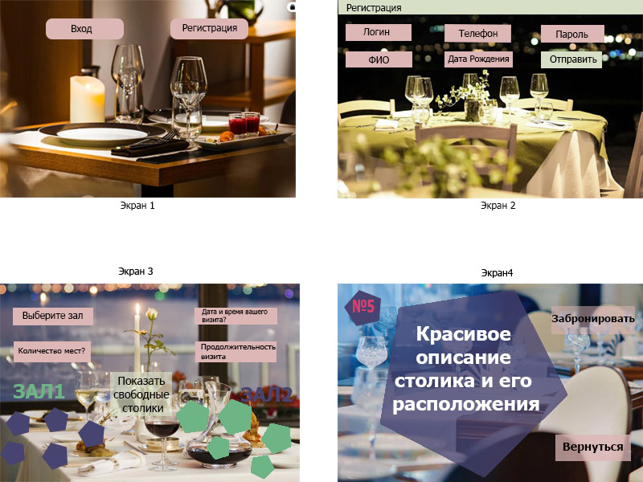

### Урок 8. Типы архитектур прикладных приложений (мобильные): MVC, MVP, MVVM.
Разработать экранные формы интерфейса в https://www.figma.com/ или https://app.diagrams.net/.

Разработать полную ERD домена в https://www.dbdesigner.net/.

Разработать блок-схему алгоритма взамодействия MVP.

